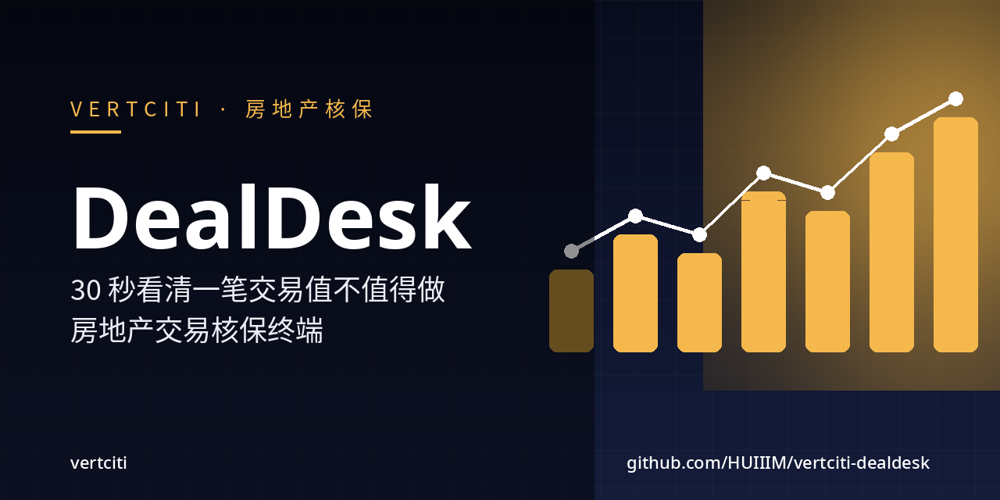
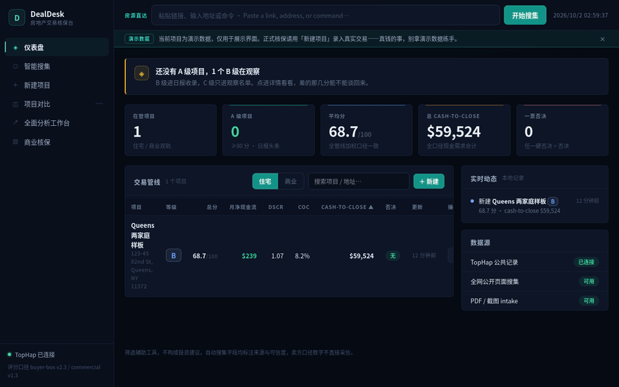
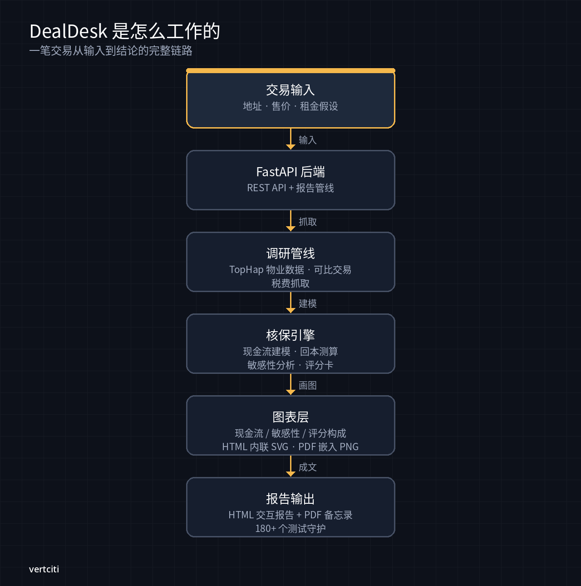
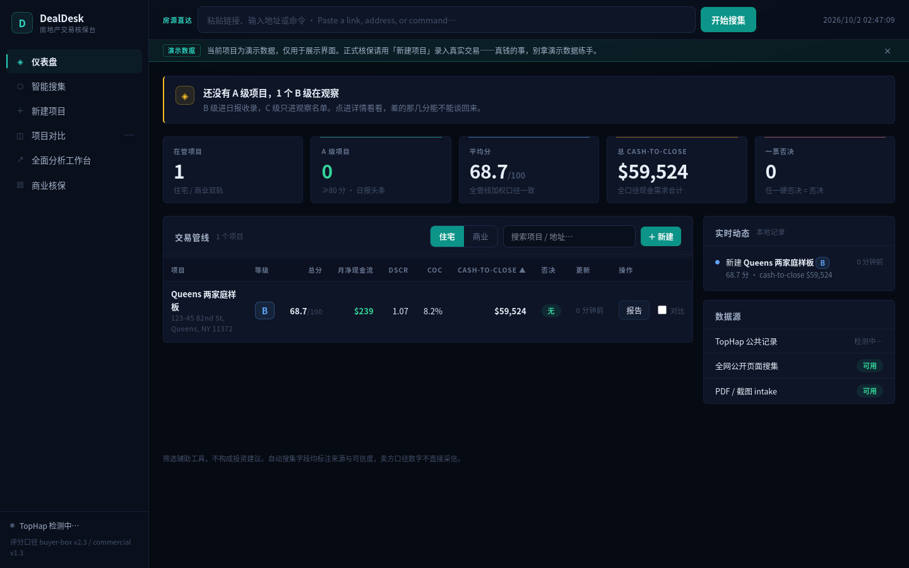
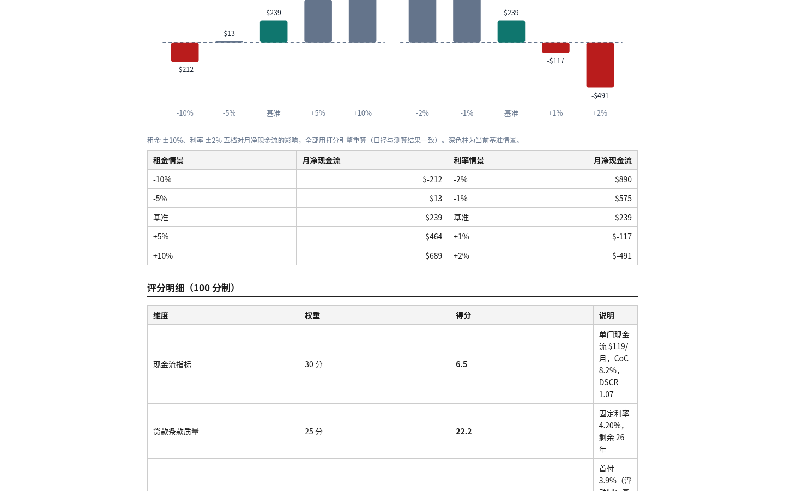

[](https://github.com/HUIIIM/vertciti-dealdesk/actions/workflows/ci.yml)
[](https://github.com/HUIIIM/vertciti-dealdesk/actions/workflows/gitleaks.yml)
[](#测试实证)
[](LICENSE)

# DealDesk · 房地产交易核保台

**录入一笔 deal 的价格、租金、贷款 → 30 分钟后你手里是一份带图、带分、带结论的中文核保报告，筛 deal 不靠感觉。**

[官网](https://vertciti.com) · [快速开始](#快速开始--30-秒) · [核心功能](#核心功能) · [FAQ](#faq)

DealDesk 是 vertciti 为 Miao 自用的房地产运营工具：住宅 / 商业双轨中文核保工作流，
统一打分引擎、全口径现金需求测算、敏感性分析、HTML 交互报告＋PDF/Excel 导出，
每个数字都标注来源＋抓取时间＋可信度，抓不到的绝不编。



*上面：一笔 Queens 两家庭交易 → 仪表盘 B 级 68.7 分 → 一键打开带图核保报告。*

## 快速开始 — 30 秒

```bash
./run.sh        # 自动建虚拟环境、装依赖、初始化数据库
```

浏览器打开 **http://127.0.0.1:8100**，点「新建项目」，3 分钟看到第一份打分。

手动方式：

```bash
python3 -m venv .venv && .venv/bin/pip install -r requirements.txt
.venv/bin/uvicorn app.main:app --host 127.0.0.1 --port 8100
```

## 它是怎么工作的



输入交易 → 搜集管线抓公开数据（TopHap 公共记录、可比成交、税费）→
核保引擎建模（现金流、回本测算、敏感性、评分卡）→ 图表层画图 →
输出 HTML 交互报告 + PDF/Excel。全程中文，数据不出本机（SQLite）。

## 核心功能



- **交易录入**：住宅 / 商业双轨中文表单，费用与风险字段按保守口径预填
- **一键打分**：双轨独立打分引擎，A / B / C / 不收录四档；硬否决项
  （浮动利率、5 年内 balloon、无退出预案、pro-forma 数字等）红色置顶。
  打分规则来自书面专家规范（`app/confidence.py` 等模块引用 §条目），
  每条分都有依据条目可查——规则是代码，不是调参
- **敏感性分析**：租金 ±10%、利率 ±2% 五档 what-if，看现金流 / CoC /
  DSCR / 入场 cap 变化
- **三张图讲清结论**：现金流回本测算、敏感性分析、评分构成
  （HTML 内联 SVG，PDF 嵌入 PNG，零 matplotlib 依赖）
- **项目对比**：最多 3 个项目并排对比
- **一键 Tear Sheet**：当前输入直接生成投资一页纸 PDF（备忘录封面＋API）
- **一键 PDF/Excel 导出**：核保备忘录 PDF、承销模型 Excel，数字与打分同源
- **全面分析工作台**（`/workbench.html`）：估值评估、可比成交、市场调查、
  六维市场报告；一键把测算结果送入打分引擎
- **智能搜集 intake**：纯地址 / 房源链接 / PDF（flyer、OM）三选一，
  自动搜集公开房源、公共记录、租金、周边、历史价格
- **intake 数据质量门**：缺关键字段或来源不可信时拦截，标注"需手动补"，
  不让脏数据进模型
- **全口径现金需求**：每笔 deal 自动汇总首付＋交割费＋首年 capex＋储备金



## 它适合哪些场景

| 场景 | DealDesk 替你干什么 |
|---|---|
| 收到中介 flyer / OM | PDF 拖进来自动抽字段，标注"卖方口径、待验证"，3 分钟出打分 |
| 手里两个项目二选一 | 3 项目并排对比表：CoC、DSCR、回本周期同列，差距一目了然 |
| 利率涨了还值吗 | 敏感性五档 what-if：利率 +2% 时现金流变多少，立刻看到 |
| 要不要跟别人合伙 | 一键 Tear Sheet：投资一页纸 PDF，直接发给对方看 |
| 每月全口径现金盘点 | 自动汇总首付＋交割费＋首年 capex＋储备金，不漏项 |

## 测试实证

| 指标 | 数字 | 说明 |
|---|---|---|
| 单元/集成测试 | **385 passed** | 本机 2026-10-06 实测，`pytest tests/` 全过 |
| 零绘图依赖 | ✅ | 图表全内联 SVG / PNG 嵌入，无 matplotlib |
| 数据驻留 | 本机 SQLite | 不上传任何交易数据 |

跑测试前先删开发副产品库（避免串扰）：

```bash
rm -f dealdesk.db   # 服务运行时先停服务再删库
.venv/bin/python -m pytest tests/ -q
```

## 诚实约定

这是筛选辅助工具，**不构成投资建议**。核心规则：

- 每个字段标注来源＋抓取时间＋可信度；抓不到的标"需手动补"，绝不编数
- 房源页 / PDF 的数字一律标"卖方口径、待验证"，独立验证先于任何结论
- 只碰公开页面、遵守 robots.txt；被反爬拦截立刻停手并记录，降级走手动录入
- 每笔真实交易签约 / 交割 / 报税前，必须经持牌本地房地产律师、
  CPA / 税务师、title company 审查

## 数据源（可选 enrich）

DealDesk 可接入 TopHap（公共房产记录聚合，MCP 协议）补充公共记录口径字段
（估值参考＋区间、贷款与产权历史、计税估值、法拍预警、可比成交等）。
默认**关闭**；打开前工作台照常走公开搜集 pipeline。
可信度标定：公共记录 = 高，算法估值 / CMA = 中（含区间），算法租金 = 低。

## 项目结构

```
dealdesk/
  app/            # FastAPI 后端：打分引擎、敏感性分析、SQLite 项目库、报告
  tools/          # 一次性脚本（如 TopHap OAuth 首次授权）
  docs/           # 集成说明文档 + assets
  static/        # 中文前端（无构建，纯 HTML/JS/CSS）
  tests/          # 单元/集成测试（385 个，2026-10-06 全过）
  run.sh          # 一键启动
  requirements.txt
  ATTRIBUTION.md  # 开源致谢与协议说明
```

## 路线图（方向级摘要，真实来源见 [ROADMAP.md](ROADMAP.md)）

**近期（每日改进台账待做）：**
扫描版 PDF OCR（intake 能力补齐）· Buy-box 自动打分（"资金很少"硬约束写成可配置 YAML）·
In-context 估值栏（cap rate/$/SF/GRM 一键反推）· Deal watchlist（跟踪中 deal 每周重跑估值＋漂移推送）·
债务时间线 · DealDesk MCP Server（pipeline/comps/承销结果暴露给自然语言查询）

**长期：** N=1 主线——只服务 Miao 一人；不做多租户、不做交易执行。

**明确不做：** AI 代采购 / AI Data Go 相关内容（已撤销产品线）；RentCast（需外部绑卡，阻塞中）。

## FAQ

**要多少钱？**
代码 MIT 免费自用；可选的 TopHap 数据 enrich 按 TopHap 自己的定价，默认关闭不花钱。

**这是投资建议吗？**
不是。输出是筛选辅助结论，每笔真实交易签约 / 交割 / 报税前必须经持牌本地房地产律师、CPA / 税务师、title company 审查。

**我的交易数据会上传吗？**
不会。数据只存本机 SQLite，不出你的机器。

**和 Zillow / Redfin 有什么区别？**
它们是房源展示；DealDesk 是你自己的核保台——打分、敏感性、现金需求全口径测算都在你手里，数字来源可查。

**为什么打分前会先拦我补数据？**
intake 数据质量门：缺关键字段或来源不可信时拦截进模型。脏数据进、脏结论出——拦你是为你好。

**为什么跑测试前要删 dealdesk.db？**
仓库根的 `dealdesk.db` 是开发副产品（测试隔离有个预先存在的 bug），有脏库时一条用例会误挂。删了再跑，30 秒的事。

## 贡献

欢迎 Issue 与 PR。先读 [CONTRIBUTING.md](CONTRIBUTING.md)，
核心原则：测试必须钉住 headline 数字、代码注释如实标注假设、绝不编造数据。

## 关于 vertciti

vertciti 为 Miao 构建运营人生的个人 AI 基础设施；DealDesk 是其中
"把工具做扎实"的一种证明。

- 官网：[vertciti.com](https://vertciti.com)
- 创始人 X：[@Miaojiahuii](https://x.com/Miaojiahuii)

## 许可证

| 模块 | 许可证 | 白话 |
|---|---|---|
| 全部代码（含 app / static / tests / tools） | MIT | 可商用、可改、闭源发布也行，保留版权声明即可 |

见 [LICENSE](LICENSE)。
